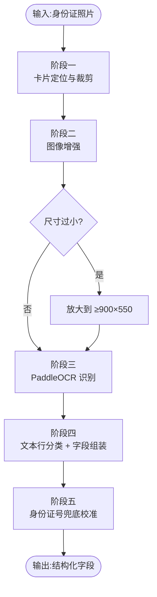
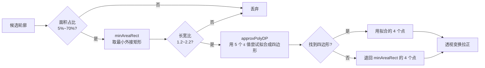
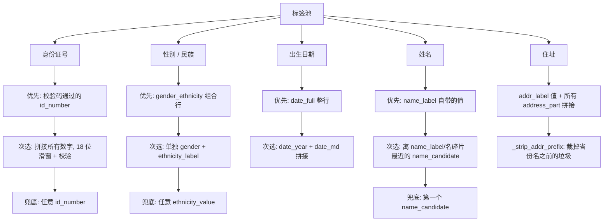

# 身份证 OCR 识别算法说明

本文档描述 `idcard_ocr.py` 的整体处理流程、各阶段使用的技术手段,以及容错设计背后的思路。

---

## 1. 总体流程

算法分 5 个阶段,从一张任意拍摄的身份证照片,输出结构化字段(姓名 / 性别 / 民族 / 出生 / 住址 / 身份证号)。



核心思路一句话:**先把卡摆正拍清楚,再让 OCR 认字,最后用"分类 + 挑选"的方式对付乱序和错字,并用身份证号校验码做兜底。**

---

## 2. 阶段一:卡片定位与裁剪(`extract_card`)

目标:从任意背景中抠出身份证并拉正。

### 2.1 预处理

- 若图片长边 > 1000 像素,先等比缩小到 1000,加速后续轮廓检测。
- 转灰度 → 高斯模糊,抑制纹理噪声。

### 2.2 多策略候选框提取

单一边缘检测经常被背景干扰,因此同时跑 **3 种策略** 并把候选合并:

| 策略 | 原理 | 适用场景 |
| --- | --- | --- |
| A. Canny 边缘 | 3 组不同阈值 `(30,100) / (50,150) / (20,80)` 各跑一次,膨胀+腐蚀补齐断边 | 背景与卡片边缘对比明显时 |
| B. 自适应阈值 | `ADAPTIVE_THRESH_GAUSSIAN_C` + 闭运算(7×7 核 × 3 次) | 光照不均、反光 |
| C. HSV 饱和度分割 | 取 `饱和度 < 70 且 亮度 > 80` 作为前景 | 彩色背景(红桌布、绿桌垫等)下卡是白色/浅色 |

### 2.3 候选框筛选

所有轮廓按面积从大到小排序,依次检查:



**关键阈值说明:**

- 真实身份证长宽比约 **1.58**(85.6 × 54.0 mm),放宽到 1.2~2.2 以容忍轻微变形。
- 面积下限 5%:避免把小图标/文字块误认为卡。
- 面积上限 70%:避免把整张照片当作卡。
- 5 个 ε 值 `[0.02, 0.03, 0.05, 0.08, 0.12]` 从严到松递进,让圆角/缺角也能拟合成四边形。

### 2.4 透视变换

用 `_order_points` 把四个点按 **左上 → 右上 → 右下 → 左下** 排序,再 `getPerspectiveTransform` 映射到标准横向矩形。若检测出来是竖着的(高>宽),旋转点位确保输出横向。

### 2.5 兜底

遍历所有候选都不合格 → 直接返回原图,不强求裁剪。

---

## 3. 阶段二:图像增强(`enhance_image`)

四步串联,让 OCR 看得清字:

```
原图 → 灰度 → 去噪(fastNlMeansDenoising h=10)
    → CLAHE 局部对比度增强(clipLimit=2.0, 8×8 tiles)
    → 锐化卷积(3×3 拉普拉斯核)
    → 转回 BGR
```

**为什么是 CLAHE 而不是全局直方图均衡?**
全局均衡会让本来就亮的区域过曝;CLAHE 按小块自适应,更适合身份证这种"文字区 + 照片区"混合内容。

之后再检查尺寸:若宽 < 900 或高 < 550,用 `INTER_CUBIC` 放大 —— PaddleOCR 对小字敏感,欠采样比过采样损失更大。

---

## 4. 阶段三:OCR 识别

调用 `PaddleOCR(use_angle_cls=True, lang="ch")`:

- `use_angle_cls=True` 会自动识别 0°/180° 方向,避免倒拍翻车。
- 返回结果是一个 **文本行列表**,但 **行顺序不保证**,且可能出现错字(例如"住址"被识别成"佳址"、"民族"识成"民旅")。

这导致阶段四不能靠"第几行是什么字段"来解析,必须按内容语义来认。

---

## 5. 阶段四:字段解析(`parse_id_card`)

这是整个算法最有意思的部分:**"分类 → 再绑定"** 两步走。

### 5.1 分类阶段(`_classify_line`)

每个 OCR 文本行经过一组正则,打上一个 **语义标签**:

| 标签 | 匹配依据 | 示例 |
| --- | --- | --- |
| `id_number` | `\d{17}[\dXx]` | `11010119900101001X` |
| `date_full` | `X年X月X日` | `1990年1月1日` |
| `date_year` / `date_md` | 年 / 月日 拆开出现 | `1990年` + `1月1日` |
| `gender_ethnicity` | 同一行里有性别字 + 民族字 | `性别 男 民族 汉` |
| `gender` | 单独一行 `男` 或 `女` | `男` |
| `ethnicity_label` / `ethnicity_value` | `民族/民旅X` 或单个民族字 | `民族汉` / `汉` |
| `name_label` | 含"姓名"或"姓 名" | `姓名 张三` |
| `addr_label` | 含"住址"(也容错"佳址""往址") | `住址 北京市...` |
| `address_part` | 含省市县区等地址关键字 | `北京市朝阳区` |
| `id_label` | 含"公民/身份/号码" | `公民身份号码` |
| `name_candidate` | 2~4 个汉字,且不含标签关键词 | `张三` |
| `label_fragment` | 单字且是标签碎片(`名 / 族 / 别 / ...`) | `名` |
| `junk` | 1~5 个非汉字垃圾字符 | `#@!` |

**关键健壮性设计:**

- `民族` 被识成 `民旅` → `[住佳往][址址]` 等容错正则专门处理。
- 性别和民族经常被挤在一行("性别男民族汉")也能一次性拆出来。

### 5.2 字段绑定阶段

每个字段从标签池里按优先级挑最合适的:



**"最近邻"选姓名的原因:**
中文名识别成 `name_candidate` 的候选可能有多个(如"姓名" + "汉族" + "张三"混在地址里),但真实姓名一定**紧挨着**"姓名"标签或剩下的"名"碎片。位置距离是最稳的信号。

**地址前缀剥离(`_strip_addr_prefix`):**
OCR 经常在"住址"前多出一两个垃圾字(如 `$住址 北京...`)。策略:从结果里找第一个省份名,若它在前 4 个字符以内,就截掉前面的杂质。

### 5.3 顺序反转补丁

有些证件照拍反了,OCR 返回的行顺序会整个倒过来。若发现"姓名"行出现在后半段,就把整个 `lines` 反转一次再分类 —— 这个 trick 简单有效。

---

## 6. 阶段五:身份证号兜底(`_verify_id_checksum` + 号码反推)

18 位身份证号里其实已经编码了出生日期和性别:

| 位 | 含义 |
| --- | --- |
| 1-6 | 地区码 |
| **7-14** | **出生日期 YYYYMMDD** |
| 15-17 | 顺序码 |
| **17** | **性别(奇数男 / 偶数女)** |
| 18 | 校验码 |

**校验算法(ISO 7064:1983 MOD 11-2):**

```
weights = [7, 9, 10, 5, 8, 4, 2, 1, 6, 3, 7, 9, 10, 5, 8, 4, 2]
total   = Σ (前 17 位 × 对应 weight)
expected_check = "10X98765432"[total % 11]
```

利用这点做两件事:

1. 筛选 OCR 结果中哪个候选才是真·身份证号(很多 18 位数字串不符合校验)。
2. 如果姓名/性别/出生识别失败,但号码识别对了,就从号码里反推出 **出生日期** 和 **性别**。

---

## 7. 容错设计速查表

| 问题 | 算法对策 |
| --- | --- |
| 背景干扰(彩色桌布) | HSV 饱和度分割策略(方法 C) |
| 卡角有圆角/缺损 | minAreaRect + 5 级 ε 的 approxPolyDP 容忍 |
| 光照不均 | CLAHE 局部增强 |
| 卡太小看不清字 | 放大到 ≥900×550 再 OCR |
| OCR 错字("民族"→"民旅") | 分类正则里显式列容错字形 |
| OCR 行顺序混乱 | 分类 + 语义绑定,不依赖位置 |
| 整张照片拍反 | 检测"姓名"位置后整体反转 |
| 18 位数字误识别 | 校验码过滤 + 数字滑窗 |
| 单字段识别失败 | 用号码反推生日 / 性别 |
| 地址前有垃圾字 | 用省份名定位正文起点 |

---

## 8. 依赖

```
opencv-python
numpy
paddleocr
paddlepaddle
```

详见 `requirements.txt`。

---

## 9. 使用

```bash
python idcard_ocr.py path/to/image.jpg
```

输出形如:

```
========== 身份证识别结果 ==========
姓名:张三
性别:男
民族:汉
出生日期:1990年1月1日
住址:北京市朝阳区XX路XX号
身份证号:11010119900101001X
====================================
```
